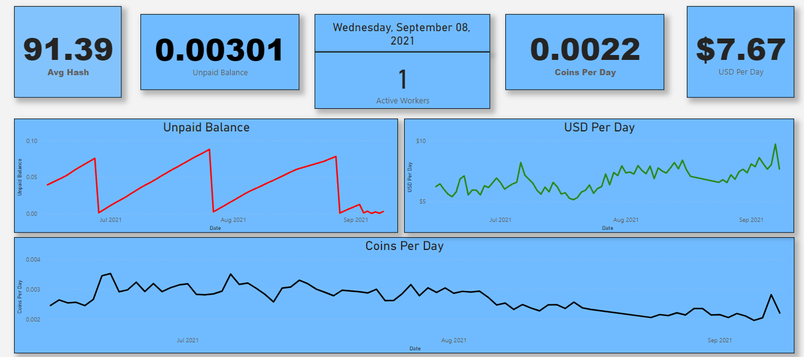
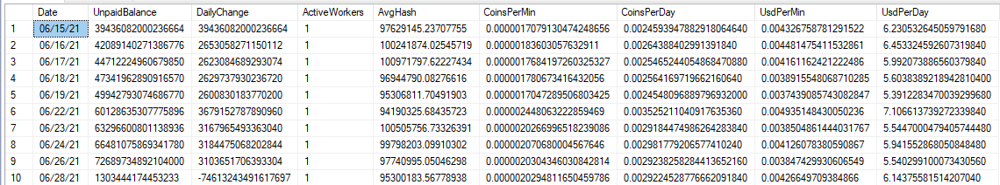

# Crypto-MinerDashboard

The Crypto-MinerDashboard pulls relevant data from Ethermine.

## Description

The Crypto-MinerDashbord is a project that uses a Power BI frontend to display miner information from Ethermine. Data is pulled by a PowerShell script via APIs. The PowerShell script connects to a SQL server and pushes data to a table [here](#sql-db-setup)

## Setup

After creating a [Power BI Dashboard](#power-bi-dashboard) and a [SQL Table](#sql-db-setup), we need to add some variable values into the PowerShell script.

```powershell
$server = "ENTER SERVER NAME"
$database = "ENTER DB NAME"
````

Add your SQL server name to the $server variable and add the Databse name to the $database variable.

````powershell
$wallet = "ENTER WALLET ADDRESS"
````

Add your wallet address to the $wallet variable. Make sure to only add the value after 0x.

## Power BI Dashboard

The Power BI report directly connects to the SQL Server and pulls data from selected tables. Simply create tiles and point them to the relevant columns.

The below image shows a possible dashboard setup:



## SQL DB Setup

In order to store the data retrieved by the PowerShell script, we need to create a SQL DB and a SQL table. The SQL table should be named "Ethermine_Dashboard" and include the following columns:

- Date: date when the data was pushed
- UnpaidBalance: balance stored in the Ethermine wallet
- DailyChange: change in unpaid balance when compared to the previous day
- ActiveWorkers: active miner count
- AvgHash: average hashrate for all miners
- CoinsPerMin: coins minder per minute
- CoinsPerDay: coins mined per day
- UsdPerMin: $ per minute
- UsdPerDay: $ per day


